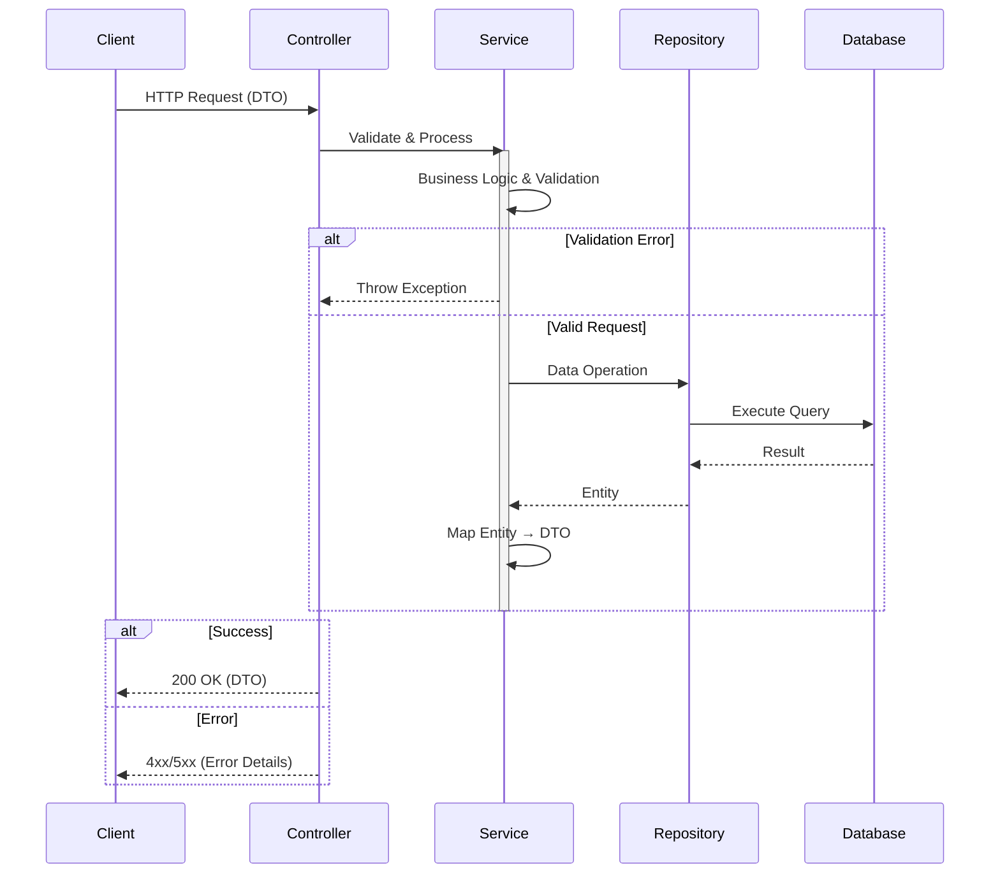
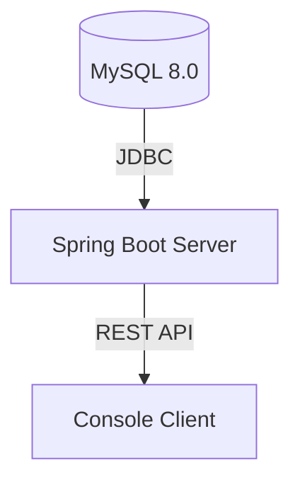

**Volunteer Platform**  
[](https://opensource.org/licenses/MIT)  
[](https://openjdk.org/projects/jdk/21/)  
[](https://spring.io/projects/spring-boot)  
[](https://github.com)


---

## 📋 Table of Contents  
- [Key Features](#-key-features)  
- [Project Structure](#-project-structure)  
- [Technology Stack](#-technology-stack)  
- [Server Architecture](#-server-architecture)  
- [API Workflows](#-api-workflows)  
- [Docker Deployment](#-docker-deployment)  
- [Scripts Guide](#-scripts-guide)  
- [Testing Strategy](#-testing-strategy)  
- [License](#-license)  
- [Contact](#-contact)  

---

## 🚀 Project Overview
Platform for coordinating volunteer activities with:
- **Role-based access**: Customers (event organizers) and Volunteers
- **Core features**: Event management, real-time messaging, session-based auth
- **Infrastructure**: Multi-module Gradle project, Dockerized services
- **CI-ready**: Integrated Jacoco coverage reports, test automation

---

## 🗂️ Project Structure  
### Server Module Deep Dive  
```plaintext
volunteer_platform/  
├── modules/  
│   ├── client/                   # Console client module  
│   │   ├── src/main/java/...     # Console UI, REST clients, utils  
│   │   └── Dockerfile            # Docker image for client  
│   │  
│   ├── server/                   # Spring Boot backend  
│   │   ├── src/main/java/...  
│   │   │   ├── controller/       # REST endpoints  
│   │   │   ├── service/          # Business logic  
│   │   │   ├── repository/       # JPA/Hibernate DAOs  
│   │   │   ├── model/            # Entity classes  
│   │   │   ├── events/           # Custom Spring events  
│   │   │   └── config/           # Security & Bean configurations  
│   │   └── Dockerfile  
│   │  
│   └── shared/                   # Shared components  
│       ├── dto/                  # Data Transfer Objects  
│       └── utils/                # Helpers
|
├── scripts/                      # Automation scripts
│   ├── run_app.sh                # Main launch script
│   └── wait-for-it.sh            # Dependency checker
|
├── docker-compose.yml            # Defines MySQL, server, client  
└── build.gradle                  # Multi-module build config  
```

---

## ⚙️ Technology Stack

### Backend
| Component               | Technology                          | Version           |
|-------------------------|-------------------------------------|-------------------|
| Framework               | Spring Boot                         | 3.1.5             |
| ORM                     | Hibernate                           | 6.2.10.Final      |
| Validation              | Hibernate Validator                 | 8.0.0.Final       |
| Database                | MySQL (Prod), H2 (Test)             | 8.0.33            |
| Build Tool              | Gradle                              | 8.5               |
| Code Quality            | Lombok, Jacoco                      | 1.18.30, 0.8.10   |

### Testing
| Tool                    | Purpose                              | Coverage         |
|-------------------------|--------------------------------------|------------------|
| JUnit 5, Mockito        | Unit & Integration Tests             | 90%+             |

---

## 🖥️ Server Architecture  
### Request Processing Flow  

---

## 📡 API Workflows  
### Customer Journey  
1. **Registration**  
```bash
POST /customers/
{
  "email": "org@example.com",
  "password": "SecurePass123!",
  "username": "event_organizer"
}
```

2. **Event Creation**  
```bash
POST /customers/events/
{
  "name": "City Cleanup",
  "description": "Monthly park maintenance",
  "location": "Minsk",
  "date": "2006-16-09",
  "startTime": "16:10"                   # Optional
  "endTime": "18:00"                     # Optional
  "requiredVolunteers": 20
}
```

3. **Response Management**  
```bash
GET /notifications/received/responses    # Use HttpServletRequest
```

### Volunteer Journey  
1. **Event Application**  
```bash
POST /volunteers/response/events/{eventId}
```

2. **Message Exchange**  
```bash
POST /users/messages/
{
  "message": "Can I bring tools?",
  "recipientEmail": "user@example.com"
}
```

---

## 🐳 Docker Deployment 
### Services Configuration
| Service     | Image                  | Port  | 
|-------------|------------------------|-------| 
| MySQL       | mysql:8.0              | 3307  |  
| Server      | volunteer_server:latest| 8080  | 
| Client      | volunteer_client:latest| -     |  

### Service Dependencies


### Build Optimization
| Layer               | Server Image        | Client Image        |  
|---------------------|---------------------|---------------------|  
| **Base**            | JDK 21 Slim         | JDK 21 Slim         |  
| **Dependency Cache**| Gradle dependencies | Gradle dependencies |  
| **Final Image**     | 2-stage build       | 2-stage build       |  
| **Size**            | ~300MB              | ~250MB              |  

**Key Practices**:
- Multi-stage builds to reduce image size
- Non-root user (`appuser`) for security
- Minimal base images (JDK Slim)
- Dependency caching for faster builds

---

### Development Setup
1. **Clone & Configure**:
```bash
git clone https://github.com/IRomanchuk06/volunteer_platform
./gradlew clean build
```

2. **Run Modules**:
```bash
# Start server
./gradlew modules:server:bootRun

# Start client (separate terminal)
./gradlew modules:client:bootRun
```

### Usage Setup
1. **Clone & Configure**:
```bash
git clone https://github.com/IRomanchuk06/volunteer_platform
./gradlew clean build
```
2. **Start the application**:
```bash
./scripts/run_app.sh
```

---

## 🛠️ Scripts Guide  
### run_app.sh Features  
| Flag          | Description                              | Use Case                     |
|---------------|------------------------------------------|------------------------------|
| `--build`     | Rebuild Docker images                   | After code changes           |
| `--verbose`   | Show detailed container logs            | Debugging startup issues     |
| `--clean`     | Remove all volumes and networks         | Factory reset simulation     |

**Usage Examples**:  
```bash
# Standard launch
./scripts/run_app.sh

# Debug mode with rebuild
./scripts/run_app.sh --verbose --build

# Complete cleanup
./scripts/run_app.sh --clean
```

---

## 🧪 Testing


---

## 📧 Contact  
**Maintainer**: Ivan Romanchuk  
**Technical Support**:  
- GitHub Issues: [Report Here](https://github.com/IRomanchuk06/volunteer_platform/issues)  
- Email: [iromanchuk06@gmail.com](mailto:iromanchuk06@gmail.com)  

---

> 🔍 **Troubleshooting Tip**:  
> Use `docker logs volunteer_server` to inspect server logs during debugging.  
> 
