# **Volunteer Platform**  
[](https://opensource.org/licenses/MIT)  [](https://openjdk.org/projects/jdk/21/)  [](https://spring.io/projects/spring-boot)  [](https://github.com)  

A backend-focused platform demonstrating modern Spring Boot development practices with **3-layer architecture** and **93% test coverage**.  
*Perfect for learning enterprise-grade Java development!*  

---

## 🌟 **Key Features**  
- 🏗️ **Clean Architecture** (Controller-Service-Repository)  
- 🔒 **Role-Based Access** (Customers/Volunteers)  
- 🧪 **Test-Driven Development** (Unit/Integration Tests)  
- 📦 **Dockerized Deployment** (MySQL + Spring Boot)  
- ✉️ **Real-Time Messaging** with Spring Events  

---

## 📋 **Table of Contents**  
1. [Project Structure](#-project-structure)  
2. [Tech Stack](#-tech-stack)  
3. [Architecture](#-architecture)  
4. [API Examples](#-api-examples)  
5. [Docker Setup](#-docker-setup)  
6. [Development Guide](#-development-guide)  
7. [Testing](#-testing)  
8. [Support](#-support)  

---

## 🗂️ Project Structure  
```text
```plaintext
volunteer_platform/  
├── modules/  
│   ├── client/                   # Console client module  
│   │   ├── src/main/java/...     # Console UI, REST clients, utils  
│   │   └── Dockerfile            # Docker image for client  
│   │  
│   ├── server/                   # Spring Boot backend  
│   │   ├── src/main/java/...  
│   │   │   ├── controller/       # REST endpoints  
│   │   │   ├── service/          # Business logic  
│   │   │   ├── repository/       # JPA/Hibernate DAOs  
│   │   │   ├── model/            # Entity classes  
│   │   │   ├── events/           # Custom Spring events  
│   │   │   └── config/           # Security & Bean configurations  
│   │   └── Dockerfile  
│   │  
│   └── shared/                   # Shared components  
│       ├── dto/                  # Data Transfer Objects  
│       └── utils/                # Helpers
|
├── scripts/                      # Automation scripts
│   ├── run_app.sh                # Main launch script
│   └── wait-for-it.sh            # Dependency checker
|
├── docker-compose.yml            # Defines MySQL, server, client  
└── build.gradle                  # Multi-module build config  
```


---

## ⚡ **Tech Stack**  

### Backend Core  
| Component       | Technology           | Purpose                          |
|-----------------|----------------------|----------------------------------|
| **Framework**       | **Spring Boot 3.2**      | REST API development             |
| **ORM**             | **Hibernate 6**          | Database interactions            |
| **Validation**      | **Hibernate Validator**  | Request validation               |
| **Build Tool**      | **Gradle 8.5**           | Dependency management            |

### Infrastructure  
| Component       | Technology           | Usage                            |
|-----------------|----------------------|----------------------------------|
| **Database**        | **MySQL 8.0**            | Production data storage          |
| **Containerization**| **Docker**               | Service isolation                |
| **Testing**         | **JUnit 5 + Mockito**    | Test automation                  |
| **Test Database**  | **Testcontainers (MySQL)** | Integration testing with isolated DB |

---

## 🏛️ Architecture  

### 3-Layer Design  

### Request Processing Flow  

```mermaid
sequenceDiagram
    participant Client
    participant Controller
    participant Service
    participant Repository
    participant Database

    Client->>Controller: HTTP Request (DTO)
    Controller->>Service: Validate & Process
    activate Service

    Service->>Service: Business Logic & Validation
    alt Validation Error
        Service-->>Controller: Throw Exception
    else Valid Request
        Service->>Repository: Data Operation
        Repository->>Database: Execute Query
        Database-->>Repository: Result
        Repository-->>Service: Entity
        Service->>Service: Map Entity → DTO
    end

    deactivate Service

    alt Success
        Controller-->>Client: 200 OK (DTO)
    else Error
        Controller-->>Client: 4xx/5xx (Error Details)
    end
```

### Key Components  
1. **Controller Layer**  
   - Handles HTTP requests/responses  
   - Input validation (`@Valid`)  
   - Exception handling  

2. **Service Layer**  
   - Business logic implementation  
   - Transaction management (`@Transactional`)  
   - Event publishing  

3. **Repository Layer**  
   - Database operations via Spring Data JPA  
   - Custom query methods  

---

## 📡 API Workflows  
### Customer Journey  
1. **Registration**  
```bash
POST /customers/
{
  "email": "org@example.com",
  "password": "SecurePass123!",
  "username": "event_organizer"
}
```

2. **Event Creation**  
```bash
POST /customers/events/
{
  "name": "City Cleanup",
  "description": "Monthly park maintenance",
  "location": "Minsk",
  "date": "2006-16-09",
  "startTime": "16:10"                   # Optional
  "endTime": "18:00"                     # Optional
  "requiredVolunteers": 20
}
```

3. **Response Management**  
```bash
GET /notifications/received/responses    # Use HttpServletRequest
```

### Volunteer Journey  
1. **Event Application**  
```bash
POST /volunteers/response/events/{eventId}
```

2. **Message Exchange**  
```bash
POST /users/messages/
{
  "message": "Can I bring tools?",
  "recipientEmail": "user@example.com"
}
```

---

### 🛠️ **Development Setup**  

**1. Clone & Build**  
```bash  
git clone https://github.com/IRomanchuk06/volunteer_platform  
cd volunteer_platform  
./gradlew clean build  # Build the entire project  
```  

**2. Run Services**  
- **Start the Server** (in one terminal):  
  ```bash  
  ./gradlew modules:server:bootRun  # Server starts on http://localhost:8080  
  ```  

- **Start the Client** (in another terminal):  
  ```bash  
  ./gradlew modules:client:bootRun  # Interactive console interface

  # Use --console=plain for better visual experience
  ```  
---

### 🚀 **Quick Start for Users**  

**1. Clone & Run with Docker**  
```bash  
git clone https://github.com/IRomanchuk06/volunteer_platform  
cd volunteer_platform  
./scripts/run_app.sh  # Starts MySQL, Server, and Client automatically  
```  

**2. Access Services**  
- **Server API**: `http://localhost:8080`  
- **MySQL Database**: Port `3307` (use tools like DBeaver)  
- **Client**: Follow on-screen instructions in the console.  

---

## 🧪 Testing  

### Strategy  
| Test Type             | Tools                     |
|-----------------------|--------------------------|
| **Unit Tests**       | JUnit 5 + Mockito        | 
| **Integration Tests** | Testcontainers + JPA     | 
| **Security Tests**    | Custom validations       | 

### Coverage Summary  
- **Total Coverage:** **94%**  
- **Full coverage (100%)**: Services, Controllers, Exception Handling, Events, Utils  
- **High coverage (~96%)**: Mappers  
- **Moderate coverage (~87%)**: Models  
- **Integration Tests focus on**: Repository layer with real database interactions using **Testcontainers + JPA**

### Run Tests

#### Run All Tests  
```bash
./gradlew test
```

#### Run Unit Tests  
```bash
./gradlew unitTests
```

##### Run Integration Tests  
```bash
./gradlew integrationTests
```

##### Run Context Tests  
```bash
./gradlew contextTest
```

##### Generate Code Coverage Report  
```bash
./gradlew jacocoTestReport

# The generated report can be found at:
# modules/server/build/reports/jacoco/test/html/index.html
``` 
---

## 📬 Support  

**Author**: Ivan Romanchuk  
**Contact**:  
[](mailto:iromanchuk06@gmail.com)  
[](https://github.com/IRomanchuk06)  

---

> 🚨 **Troubleshooting Tip**  
> Use `docker-compose logs server` to view real-time server logs  
> 
> 🔄 **Need to Reset?**  
> Run `docker-compose down -v && docker rmi volunteer_server volunteer_client`
